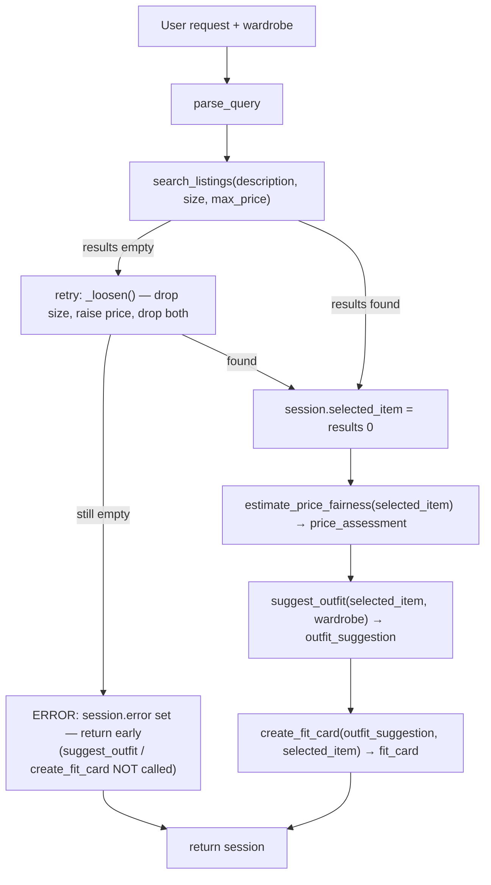

<!-- Reference note: this planning.md was written before the implementation and
     updated when the two stretch features were added. The tool signatures,
     session keys, and branch logic below match tools.py and agent.py exactly.
     If you adapt it, keep this file and the code in sync. -->

# planning.md — FitFindr

## What FitFindr does

FitFindr is a multi-tool agent that helps someone find a secondhand piece and
figure out how to wear it. From one natural-language request it parses out what
to search for, finds matching listings, checks whether the price is fair, styles
the top match against the user's wardrobe, and writes a shareable caption. The
agent reacts to what each tool returns: if the search finds nothing it retries
with looser filters, and if it still finds nothing it stops and explains why
instead of styling an item that doesn't exist.

## A complete interaction

Request: *"I'm looking for a vintage graphic tee under $30, size M. I mostly
wear baggy jeans and chunky sneakers."*

1. **Parse** → `parse_query` extracts `description="vintage graphic tee"`,
   `size="M"`, `max_price=30.0`. (The wardrobe comes from the user's saved
   profile, not the sentence — see State Management.)
2. **Search** → `search_listings("vintage graphic tee", "M", 30.0)` returns 3
   matches sorted by relevance. The agent stores `selected_item = results[0]`:
   *Faded Band Tee — $22, Depop, Good condition.*
3. **Price check** → `estimate_price_fairness(<band tee>)` compares $22 to the
   median of comparable tees and returns **"fair."**
4. **Suggest outfit** → `suggest_outfit(<band tee>, <wardrobe>)` returns
   something like: *"Pair it with your baggy wide-leg jeans and chunky platform
   sneakers; roll the sleeves once and half-tuck the front for shape."*
5. **Fit card** → `create_fit_card(<suggestion>, <band tee>)` returns:
   *"thrifted this faded band tee off depop for $22 and it was made for my
   wide-legs 🖤"*

Error path: if step 2 returns nothing even after the retry, the agent sets an
error message and returns. It does **not** call `suggest_outfit` or
`create_fit_card` with empty input.

## Tools

### Tool 1 — `search_listings(description, size=None, max_price=None)` → `list[dict]`
- **description** (`str`): free-text query, e.g. `"vintage graphic tee"`.
  Tokenized and matched against each listing's title, description, style_tags,
  category, and brand.
- **size** (`str | None`): exact size required, e.g. `"M"` or `"32"`. `None` = any.
- **max_price** (`float | None`): inclusive price ceiling. `None` = no ceiling.
- **Returns**: a list of matching listing dicts. Each dict has the original
  fields (id, title, description, category, style_tags, size, condition, price,
  colors, brand, platform) plus an added integer `relevance`. Sorted by
  `relevance` descending, then `price` ascending.
- **Failure mode**: no matches → returns `[]` (never raises). The agent decides
  what to do next (retry, then error).

### Tool 2 — `suggest_outfit(new_item, wardrobe)` → `str`
- **new_item** (`dict`): a listing dict, normally `search_listings()[0]`.
- **wardrobe** (`dict`): `{"items": [ {type, descriptor, colors, style_tags,
  fit}, ... ]}`. May be empty.
- **Returns**: a 2–3 sentence styling suggestion (always a non-empty string).
- **Failure modes**: empty wardrobe → returns general styling advice built
  around the item and says it's general (does not crash). LLM/network/key error
  → returns a deterministic rule-based suggestion so the agent stays useful.

### Tool 3 — `create_fit_card(outfit, new_item)` → `str`
- **outfit** (`str`): the styling suggestion from `suggest_outfit`.
- **new_item** (`dict`): the listing dict the outfit is built around.
- **Returns**: a short, casual, social-style caption. Uses a high LLM
  temperature so different inputs produce different captions.
- **Failure modes**: empty/blank `outfit` → returns a clear "[fit card
  unavailable] …" message **before** calling the LLM (no crash). LLM error →
  returns a deterministic templated caption that still varies by item.

### Tool 4 (stretch) — `estimate_price_fairness(item, listings=None)` → `dict`
- **item** (`dict`): a listing dict (needs `category` and `price`).
- **listings** (`list[dict] | None`): comparison pool; defaults to the full
  dataset.
- **Returns**: `{"verdict", "item_price", "median_price", "comparable_count",
  "message"}` where verdict is one of *great deal / fair / slightly high /
  overpriced / unknown*.
- **Failure mode**: fewer than 2 comparable listings → verdict `"unknown"` with
  an explanatory message (no division by zero, no guessing).

## Planning loop (the actual conditional logic)

`run_agent(query, wardrobe)` runs these branches in order, writing everything
to one `session` dict:

1. `params = parse_query(query)` → store in `session["search_params"]`.
2. `results = search_listings(**params)`.
3. **If `results` is empty**, enter the retry loop: for each progressively
   looser parameter set from `_loosen(params)` — first drop the size filter,
   then drop size and raise `max_price` by 50%, then drop both filters —
   re-run `search_listings`. On the first non-empty retry, set `results`,
   record the adjustment in `session["adjustments"]`, and break.
4. **If `results` is still empty**, set `session["error"]` to a specific message
   ("…try a broader description, a higher budget, or a different size"), log it,
   and `return session` immediately. `suggest_outfit` and `create_fit_card` are
   **not** called.
5. Otherwise set `session["selected_item"] = results[0]` and
   `session["search_results"] = results`.
6. `session["price_assessment"] = estimate_price_fairness(results[0])`.
7. `session["outfit_suggestion"] = suggest_outfit(results[0], wardrobe)`.
8. `session["fit_card"] = create_fit_card(session["outfit_suggestion"], results[0])`.
9. `return session`.

The agent's behavior changes with the input: an impossible query exits at step 4
having called only `search_listings`; a query that needs loosening calls
`search_listings` several times and tells the user what was adjusted; a normal
query runs all four tools. Every branch appends a line to `session["log"]`.

## State management

All state lives in one `session` dict created per request:

| Key | Written by | Read by |
|-----|-----------|---------|
| `query`, `wardrobe` | caller / app | parse + suggest_outfit |
| `search_params` | step 1 (and updated in retry) | search |
| `search_results`, `selected_item` | step 5 | price check, suggest_outfit, fit card |
| `price_assessment` | step 6 | app display |
| `outfit_suggestion` | step 7 | create_fit_card |
| `fit_card` | step 8 | app display |
| `adjustments` | retry loop | app display ("found after I…") |
| `error` | step 4 | app display (error branch) |
| `log` | every step | app "decision log" panel + demo |

The key flows: `selected_item` (set once at step 5) is passed into both
`estimate_price_fairness` and `suggest_outfit`; the string returned by
`suggest_outfit` is passed straight into `create_fit_card`. The user never
re-enters the item — it moves through the session.

## Architecture

```
                         User request (+ wardrobe choice)
                                      │
                                      ▼
                              parse_query()
                                      │  {description, size, max_price}
                                      ▼
          ┌─────────────────── PLANNING LOOP ──────────────────────────┐
          │                                                            │
          │  search_listings(description, size, max_price)             │
          │            │                                               │
          │            │ results == []                                 │
          │            ├──► retry: _loosen() → drop size, raise price,  │
          │            │         drop both  (record adjustment)        │
          │            │            │                                  │
          │            │            │ still []                         │
          │            │            └──► [ERROR] session["error"]  ─────┼──► return
          │            │                  (suggest_outfit / fit card    │    (early)
          │            │                   NOT called)                  │
          │            │ results == [item, ...]                         │
          │            ▼                                                │
          │   session["selected_item"] = results[0]                    │
          │            │                                                │
          │            ├──► estimate_price_fairness(selected_item)      │
          │            │        → session["price_assessment"]           │
          │            │                                                │
          │            ├──► suggest_outfit(selected_item, wardrobe)     │
          │            │        → session["outfit_suggestion"]          │
          │            │                                                │
          │            └──► create_fit_card(outfit_suggestion, item)    │
          │                     → session["fit_card"]                   │
          └────────────────────────────┬───────────────────────────────┘
                                        ▼
                                 return session
```



## Error handling

| Tool | Failure | What the agent does |
|------|---------|---------------------|
| `search_listings` | no matches | Retries with looser filters (drop size, raise budget, drop both). If still empty, returns a specific message naming what to try (broader description, higher budget, different size) and stops before the LLM tools. |
| `suggest_outfit` | empty wardrobe | Still returns a complete outfit built around the item from common staples, and notes it's general advice. |
| `suggest_outfit` | LLM/network/key error | Returns a deterministic rule-based pairing (uses the wardrobe pieces if present) so the user still gets a suggestion. |
| `create_fit_card` | empty outfit string | Returns "[fit card unavailable] …" without calling the LLM or crashing. |
| `create_fit_card` | LLM/network/key error | Returns a deterministic templated caption that varies by item. |
| `estimate_price_fairness` | < 2 comparable listings | Returns verdict `"unknown"` with an explanatory message instead of dividing by zero. |

## AI Tool Plan

- **Milestone 3 — tools.** For `search_listings` I gave Claude the Tool 1 spec
  block (inputs, return, failure mode) and asked it to implement filtering with
  `load_listings()` plus a token-overlap relevance score; I verified it filtered
  on all three parameters and returned `[]` (not an error) for no matches before
  trusting it. For `suggest_outfit` and `create_fit_card` I gave the Tool 2/3
  blocks and asked for the Groq calls plus the empty-wardrobe and empty-outfit
  guards; I checked the guards fire before any network call.
- **Milestone 4 — planning loop.** I gave Claude the Planning Loop section and
  the architecture diagram and asked it to implement `run_agent` with the retry
  branch and the early error return. I verified it branches on the search result
  (it does not call all four tools unconditionally) and that the no-results case
  leaves `fit_card = None`.
- **Verification before use, every time:** run the no-results case, the
  empty-wardrobe case, and the empty-outfit case, and confirm each returns a
  specific message rather than an exception.

## Stretch features (added; planning updated before building)

- **Price comparison tool** (`estimate_price_fairness`) — the 4th tool above.
  Called at step 6 of the loop; informs the user but does not block the flow.
- **Retry with fallback** — step 3 of the loop. On an empty search the agent
  loosens constraints and reports the adjustment, instead of failing on the
  first miss.
